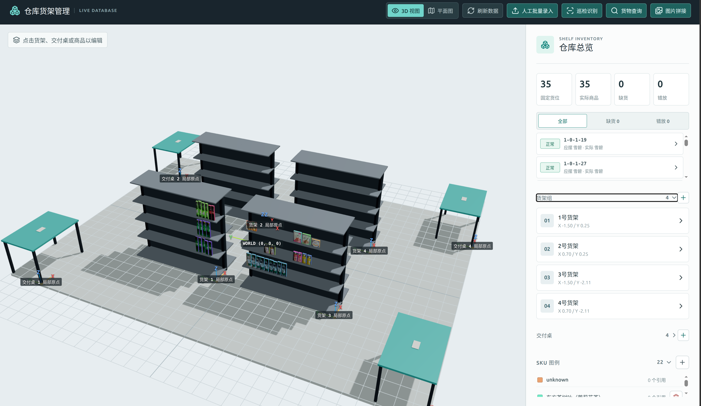
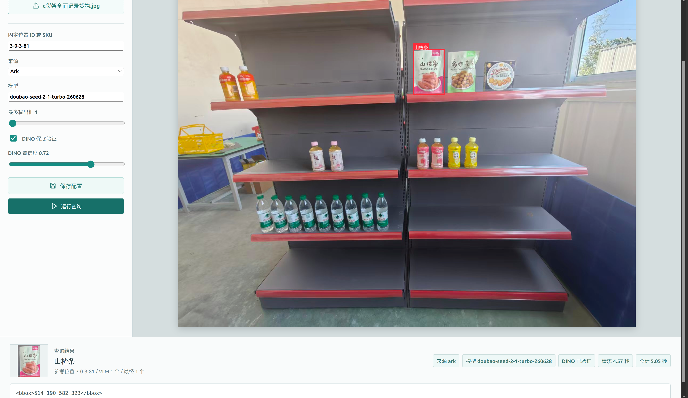
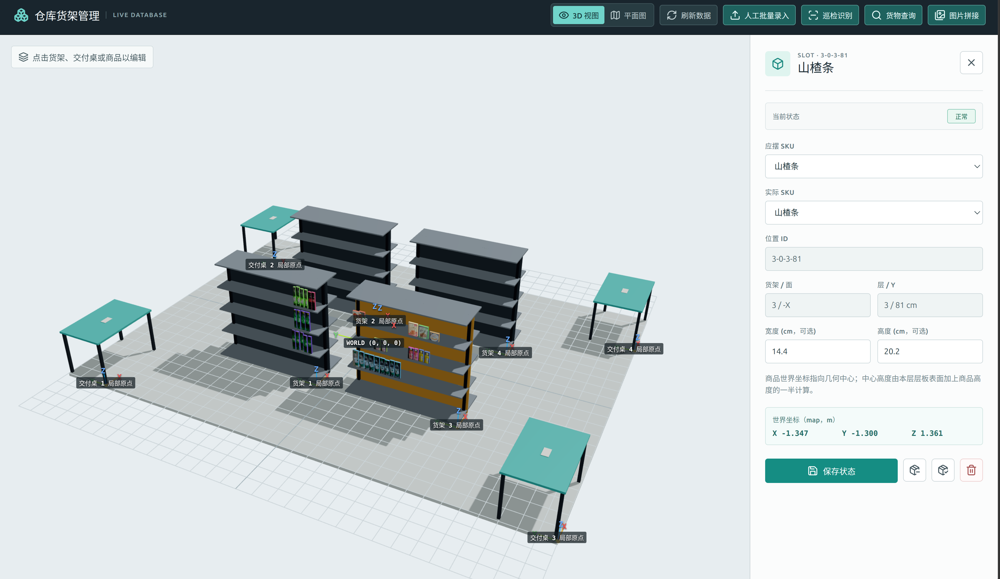

# 超市货架场景管理器

超市货架场景管理系统：用 React + Three.js 管理货架，用 SQLite 记录稳定货位与库存状态，并提供人工录入、巡检识别、SKU 查询、货架面图片拼接和 ROS2 机器人服务。

## 系统界面

<p align="center">
  
</p>

系统提供货架三维场景、库存状态、视觉巡检、货物查询和人工录入等工作界面：

<table>
  <tr>
    <td width="50%"></td>
    <td width="50%"></td>
  </tr>
  <tr>
    <td align="center">货架巡检</td>
    <td align="center">货物识别</td>
  </tr>
  <tr>
    <td width="50%"></td>
    <td width="50%"></td>
  </tr>
  <tr>
    <td align="center">货品详细查看</td>
    <td align="center">AI 辅助批量录入</td>
  </tr>
</table>

## 核心数据模型

一个 `slot` 是货架上的固定位置，首次录入时生成稳定的 `slot_id`：`{shelf_id}-{face}-{level}-{y_cm}`。后续缺货、错放和补货都只更新 SKU，不改变位置 ID。

| 字段 | 含义 |
| --- | --- |
| `expected_sku` | 该位置应摆放的 SKU |
| `actual_sku` | 该位置当前实际 SKU；`NULL` 表示缺货 |
| 状态 | 由两个字段派生：相同为正常，`actual_sku = NULL` 为缺货，否则为摆放错误 |

`shelf_inventory.db` 是唯一业务真源。每次通过 API 改动货位后，服务会同步生成 `data/shelf_calibration/{shelf_id}.json` 的 `slots` 投影，供 CV 快速读取。不要手工分别维护数据库和 JSON。世界坐标由稳定 `slot_id` 和货架参数统一查询。

## 文档导航

| 文档 | 内容 |
| --- | --- |
| [数据库与 API 文档](docs/database_schema_and_api.md) | SQLite 表结构、固定位置模型、校准 JSON 与世界坐标公式。 |
| [HTTP Web API：请求参数与 JSON 返回](docs/robot_web_api.md) | `api_server.py` 的视觉识别、坐标查询、取放货和场景维护端点。 |
| [ROS2 服务：输入参数与输出结构](docs/ros2_service_api.md) | 各 `.srv` 请求字段、各 `.msg` 返回字段、节点参数和机器人调用流程。 |
| [比赛巡检 RGB-D 缺货复现与迁移](docs/competition_rgbd_stockout_reproduction.md) | 独立 RGB-D 缺货识别链路、采集、算法参数、SKU 检索和数据库关联。 |

## 使用方式

| 使用者 | 入口 | 用途 |
| --- | --- | --- |
| 人工管理 | React Web | 货架、SKU、固定位置、人工录入、调试图和审核。 |
| 其他本机程序 | `api_server.py` HTTP JSON API | 调用 Web API；巡检和货物查询传 `debug: false` 时不生成调试产物。 |
| ROS2 机器人 | `supermarket_scene_ros` 服务节点 | 直接调用 `robot_service.py`，传递类型化 ROS 消息，不经过 HTTP 或 Base64。 |

Web 与 ROS2 都读写 `shelf_inventory.db`。固定位置写入后会同步重建对应货架的 `data/shelf_calibration/{shelf_id}.json`。当前按单个写入进程使用，尚未实现 Web API 与 ROS2 节点并发写入时的跨进程锁。

## 仓库结构

```text
.
├── api_server.py             本地 HTTP JSON API，视觉模型在启动时预加载
├── shelf_database.py         SQLite 表结构、迁移、坐标和库存读写
├── calibration_manager.py    数据库到 CV 校准 JSON 的同步
├── init_database.py          重建示例数据库
├── web/                      React + Three.js 管理界面
├── vision/                   巡检、SKU 查询、图片拼接和共享视觉模块
├── robot_service.py          机器人直接调用的无传输层业务入口
├── ros2/
│   ├── rgbd_capture/                 D435i RGB、深度和内参离线采集脚本
│   ├── supermarket_scene_interfaces/  ROS2 msg/srv 接口包
│   └── supermarket_scene_ros/         rclpy 服务节点包
├── mujoco/                   MuJoCo 场景生成器、MJCF 和模型资产
├── tests/                    固定货位与状态逻辑测试
├── test_pic/                 本地测试图片
└── data/                     本地运行时照片和校准 JSON，已忽略
```

## Web 与 HTTP API

Python 依赖使用 `uv`，前端依赖使用 npm：

```bash
uv sync
cd web
npm install
```

需要 Ark VLM 或其他远程模型时，创建本地配置并填入密钥：

```bash
cp vision/config.example.yaml vision/config.local.yaml
```

`vision/config.example.yaml` 是可提交的模板；`vision/config.local.yaml` 是运行时本地配置，已忽略。没有本地配置时服务采用 `vision/config.py` 的默认参数，涉及远程 VLM 的功能则需要对应 API Key。

在仓库根目录启动 API：

```bash
uv run python api_server.py
```

首次启动会下载并加载 DINOv2 与 OWLv2 权重；本地 OWLv2 查询固定使用 `google/owlv2-large-patch14-ensemble`。

比赛巡检使用本地 `Qwen/Qwen3.5-4B`。RGB-D 缺货回合从项目内 `test_pic/rgbd_stockout/` 测试样本读取 RGB、深度和 metadata；异常摆放回合上传一张局部 RGB 图。

```bash
uv run python vision/download_qwen35_modelscope.py
```

脚本使用 ModelScope Python SDK 直连下载到 `vision/models/Qwen3.5-4B`，支持断点续传。

在另一个终端启动网页：

```bash
cd web
npm run dev
```

打开 `http://127.0.0.1:5173`。前端会将 `/api` 代理到 `http://127.0.0.1:8000`。

## Web 功能

- **货架管理**：维护货架、交付桌、SKU 和固定货位，提供 2D/3D 视图。
- **人工批量录入**：标定货架面、框选已有商品或空位，填写 `expected_sku` 与 `actual_sku` 后批量写入；导入审核可按 SKU 用最多三张最大正常裁剪图生成并编辑 OWLv2 英文自由文本对象描述。
- **巡检识别**：上传局部货架照片，先用 SIFT 配准和 Lab 色彩距离筛选货位异常，再以 DINOv2 识别 SKU；可选 Ark VLM 保底。结果仅在点击“应用修改”后才更新数据库和 JSON。
- **比赛巡检**：两个互斥回合。RGB-D 缺货回合从服务器预置 D435i 样本定位第一排缺失后暴露的后排商品；异常摆放回合上传一张局部 RGB 图，由本地 Qwen 识别连续同类商品序列中的明显异类（0 至 2 个）。两者均用 DINO 检索手机录入商品图，低置信度时由本地 Qwen 在无分数 Top-3 候选板复核。结果只读，不写库存状态。
- **货物查询**：按 SKU 或固定位置查询局部照片中的目标货物，可使用 Ark 等 VLM，或本地 `google/owlv2-large-patch14-ensemble` 英文对象描述检索；输入 SKU 时优先选取正常 slot 的参考裁剪图，两条路径都可选 DINOv2 复核候选框。
- **图片拼接**：上传同一货架面的 2 至 8 张重叠照片，手工选择主平面。后端对所有图片两两进行 SIFT/MAGSAC 匹配，拼接主图所在的可靠连通组；再用 GraphCut 接缝选择和三层多频段融合输出拼接图。结果可四点透视校正后下载，或直接送到人工批量录入。

Web 对巡检和 SKU 查询固定传递 `debug: true`，结果保存在 `vision/output/`：巡检为 `slot_inspection/{run_id}/`，SKU 查询为 `vlm_sku_query/{run_id}/`，图片拼接为 `image_stitch/{run_id}/`，RGB-D 缺货为 `rgbd_stockout/{run_id}/`，RGB 异常摆放为 `rgb_misplacement/{run_id}/`。这些都是可删除的运行产物。其他 HTTP/ROS2 调用不传或传递 `debug: false` 时，巡检和 SKU 查询直接返回结果，不创建运行目录、不绘制图像或写入中间文件。

页面保存的巡检和 SKU 查询参数写入 `vision/config.local.yaml`。单次 API 请求可携带 `config` 覆盖本次运行参数，但不会回写本地配置。

## ROS2 服务节点

ROS2 源码位于 `ros2/`，本仓库当前没有 ROS2 环境，因此尚未执行 `colcon build` 或运行时验证。接口定义、Python 语法和 XML 已做静态检查。

在安装 ROS2 且已安装本项目 Python 依赖的机器上，将两个包放入 ROS2 工作区的 `src/` 后构建：

```bash
source /opt/ros/$ROS_DISTRO/setup.bash
cd /path/to/ros2_ws
colcon build --packages-select supermarket_scene_interfaces supermarket_scene_ros
source install/setup.bash
export SUPERMARKET_SCENE_ROOT=/path/to/supermarket_scene
ros2 run supermarket_scene_ros supermarket_scene_node
```

节点启动时预加载 DINOv2 和 OWLv2。Ark 等远程 VLM 仍读取仓库根目录的 `vision/config.local.yaml` 或对应环境变量；节点参数 `provider=local` 时仅使用已审核的 `owlv2_prompt`，不需要云端 API Key。`sku_query.dino_fallback`、`sku_query.dino_confidence_threshold`、`sku_query.owlv2_score_threshold` 与 `sku_query.max_boxes` 是节点级查询配置。

首期服务包括：

```text
/supermarket_scene/inspect_shelf
/supermarket_scene/find_sku
/supermarket_scene/get_slot_pose
/supermarket_scene/get_sku_locations
/supermarket_scene/list_shortages
/supermarket_scene/list_misplacements
/supermarket_scene/take_slot
/supermarket_scene/restock_slot
/supermarket_scene/update_slot
```

同时提供货架、交付桌和固定位置的新建/修改服务。完整消息字段、服务名、状态语义及调用流程见 [ROS2 服务：输入参数与输出结构](docs/ros2_service_api.md)。ROS2 视觉服务固定采用 `debug=false`：不会写中间图片、运行目录或结果 JSON，也不会自动修改库存。

## MuJoCo

从仓库根目录运行：

```bash
uv run python -m mujoco.generate_scene
uv run python -m mujoco.generate_scene_from_database
uv run python -m mujoco.take_screenshots
```

`init_database.py` 会删除并重建 `shelf_inventory.db`，仅用于重置示例/测试数据：

```bash
uv run python init_database.py
```

## 检查

```bash
uv run python -m unittest tests.test_fixed_slots
uv run python -m py_compile api_server.py shelf_database.py calibration_manager.py scene_geometry.py init_database.py mujoco/*.py vision/*.py
cd web && npm run build
```

没有 ROS2 环境时，可额外检查 ROS2 源码文件而不构建：

```bash
python3 -c "import ast; from pathlib import Path; [ast.parse(p.read_text(encoding='utf-8')) for p in Path('ros2').rglob('*.py')]"
```

`.gitignore` 已排除本地 `data/`、`vision/output/`、模型权重、Python 缓存与前端构建产物。
